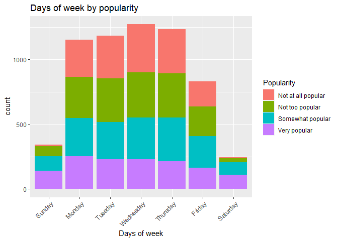
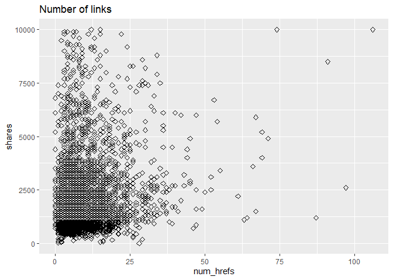
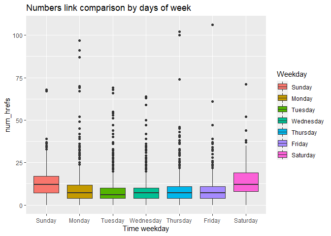
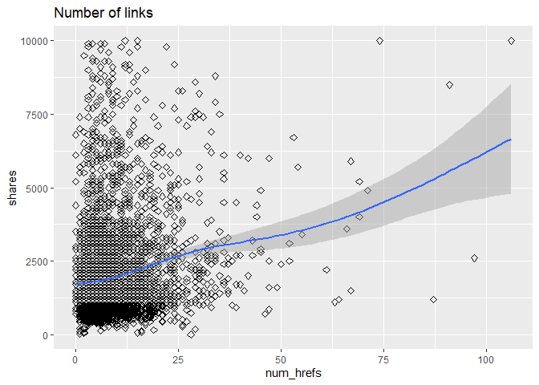

Bus
================

-   [Intro](#intro)
-   [Requirements](#requirements)
-   [Data manipulaton](#data-manipulaton)
    -   [Read in Data](#read-in-data)
-   [Summarizations](#summarizations)
    -   [Exploratory Data Anaysis](#exploratory-data-anaysis)
    -   [Shares by days of week](#shares-by-days-of-week)
    -   [shares by popularity](#shares-by-popularity)
    -   [count of news by popularity over different days of
        week](#count-of-news-by-popularity-over-different-days-of-week)
    -   [Days of week](#days-of-week)
    -   [Number of links](#number-of-links)
    -   [Number of words in the title and
        content](#number-of-words-in-the-title-and-content)
    -   [Correlation with numeric
        variables](#correlation-with-numeric-variables)
-   [Modeling](#modeling)

## Intro

This project aims at building predictive models on the [Online News
Popularity](https://archive.ics.uci.edu/ml/datasets/Online+News+Popularity#)
dataset. Our goal is to build models that predict the number of shares
an article receives based on characteristics of the article. This work
is important to help writers/companies understand factors that influence
article success (as measured by the number of shares an article
obtains). This work could also be integrated in the calculation of
advertisement space on articles (articles that receive more shares
should demand more for ad space).

The characteristics we will explore include day of week, number of
links, word count of title, word count of content + `weekday`: day of
week that article was published (Monday, Tuesday, …) + `num_hrefs`:
number of links referenced in article + `n_tokens_title`: word count of
title + `n_tokens_content`: word count of article +
`rate_positive_words` and `rate_negative_words`: rate of
positive/negative words among non-neutral tokens

The models used to build … continue from here Data was split by channel
type…

## Requirements

``` r
library(tidyverse)
library(corrplot)
```

## Data manipulaton

### Read in Data

``` r
# read entire dataset
  # subset to get the data channel we want
    # remove unnessary columns
df <- read_csv('data/OnlineNewsPopularity.csv') %>%
        filter((!!sym(paste0('data_channel_is_', params$channel))) == 1) %>%
          select(-contains('data_channel_is'))
```

    ## Rows: 39644 Columns: 61

    ## -- Column specification -------------------------------------------------------------------------------------------
    ## Delimiter: ","
    ## chr  (1): url
    ## dbl (60): timedelta, n_tokens_title, n_tokens_content, n_unique_tokens, n_non_stop_words, n_non_stop_unique_tok...

    ## 
    ## i Use `spec()` to retrieve the full column specification for this data.
    ## i Specify the column types or set `show_col_types = FALSE` to quiet this message.

``` r
dim(df)
```

    ## [1] 6258   55

The object `df` now holds a subset of the data according to the
specified data channel. Now, we must create new features to consolidate
variables and prepare the dataset for exploratory data analysis:

``` r
# Create a variable that holds day of week
levels = c('Sunday', 'Monday', 'Tuesday', 'Wednesday','Thursday', 'Friday', 'Saturday')
df <- df %>% mutate(weekday = ifelse(weekday_is_monday==1, 'Monday', 
                                ifelse(weekday_is_tuesday==1, 'Tuesday',
                                ifelse(weekday_is_wednesday==1, 'Wednesday',
                                ifelse(weekday_is_thursday==1, 'Thursday', 
                                ifelse(weekday_is_friday==1, 'Friday',
                                ifelse(weekday_is_saturday==1, 'Saturday', 'Sunday'
                                       ))))))) %>%
                mutate(weekday = factor(weekday, levels = levels))


# function to create the popularity column. 
# popularity rating was created with summary stat info (25%, median, and 75%)
popularityCol <- function(dataset){
  dataset <- dataset %>% 
    mutate("Popularity" = if_else(shares > 2800, "Very popular",
                           if_else(shares > 1400, "Somewhat popular", 
                            if_else(shares > 946, "Not too popular", "Not at all popular")) 
                           )
    )            
  return(dataset)
}

# Data set using popularityCol function.
df <- popularityCol(df) %>% as_tibble()

# Overwrite popularity column with factor version
df$Popularity <- as.factor(df$Popularity)

# Use ordered function on a factor to order the levels
df$Popularity <- ordered(df$Popularity, levels = c("Not at all popular", "Not too popular", "Somewhat popular", "Very popular"))

# split data into train and test sets
train_rows <- sample(nrow(df), 0.7*nrow(df))
trainData <- df[train_rows,]
testData <- df[-train_rows,] 
```

## Summarizations

### Exploratory Data Anaysis

The summary statistics of targeted variable (shares)

``` r
# summary statistics
share_stat <- df %>% 
                summarise(Count = n(),
                          Min = min(shares), 
                          Q1 = quantile(shares, 0.25),
                          Median = median(shares),
                          Average = mean(shares),
                          Q3 = quantile(shares, 0.75),
                          Max = max(shares),
                          Std.Dev = sd(shares)
                          )

# Display a table of the summary stats.
knitr::kable(share_stat, caption = "Summary Stats by shares", digits = 2)
```

| Count | Min |     Q1 | Median | Average |   Q3 |    Max |  Std.Dev |
|------:|----:|-------:|-------:|--------:|-----:|-------:|---------:|
|  6258 |   1 | 952.25 |   1400 | 3063.02 | 2500 | 690400 | 15046.39 |

Summary Stats by shares

### Shares by days of week

``` r
df %>%
  group_by(weekday) %>%
  summarise(total_shares = sum(shares), avg_shares = round(mean(shares)), max_shares = max(shares)) %>%
  knitr::kable()
```

| weekday   | total\_shares | avg\_shares | max\_shares |
|:----------|--------------:|------------:|------------:|
| Sunday    |       1215518 |        3544 |       56900 |
| Monday    |       4482214 |        3887 |      690400 |
| Tuesday   |       3466021 |        2932 |      310800 |
| Wednesday |       3401897 |        2677 |      158900 |
| Thursday  |       3560327 |        2885 |      306100 |
| Friday    |       1966657 |        2364 |      102200 |
| Saturday  |       1075736 |        4427 |      144400 |

The above table shows a breakdown of total, average, and maximum number
of shares for articles published on a specific weekday for this channel.
Some channels tend to have more popular days than others.

### shares by popularity

``` r
df %>% 
  group_by(Popularity) %>%
  summarise(total_shares = sum(shares), avg_shares = round(mean(shares)), max_shares = max(shares)) %>%
  knitr::kable()
```

| Popularity         | total\_shares | avg\_shares | max\_shares |
|:-------------------|--------------:|------------:|------------:|
| Not at all popular |       1113353 |         722 |         946 |
| Not too popular    |       1977017 |        1171 |        1400 |
| Somewhat popular   |       3369800 |        1992 |        2800 |
| Very popular       |      12708200 |        9505 |      690400 |

The above table show a summary of the newly created `popularity`
variable.

### count of news by popularity over different days of week

``` r
#Bar plot of weekday by popularity 

ggplot(data = df, aes(x = weekday)) +
  geom_bar(aes(fill = as.factor(Popularity))) + 
  labs(x = "Days of week", 
       title = "Days of week by popularity") +
  theme(axis.text.x = element_text(angle = 45, hjust=1)) +
  scale_fill_discrete(name = "Popularity") 
```

<!-- -->

The bar plot above shows a breakdown of the number of articles published
vs day of week. We can also see a breakdown of the proportion of
popularity of articles for each day. This plot is important to
understand if a greater number of shares exhibited by a day of the week
is due to more articles being published on that day, or if it is due to
that day of week having a direct effect on the number of shares.

For example, if all days have the same number of ‘very popular’
articles, we could hypothesize that day of week does not have an effect
on producing ‘very popular’ articles.

### Days of week

``` r
# histogram for day of week vs shares

g2 <- df %>% ggplot(aes(x=weekday, y=shares)) +
        geom_bar(stat="identity", fill = "darkblue") + 
   theme(axis.text.x = element_text(angle = 45, vjust = .75)) +
        ggtitle('Day of Week and Total Number of Shares')
g2
```

<!-- -->

The above histogram shows a basic count of the total number of shares
for all articles published on each day of week.

### Number of links

``` r
# simple scatter plot
g1 <- df %>% ggplot(aes(x=num_hrefs, y=shares)) +
        geom_point(size=2, shape=23) +
        ylim(0, 10000)
g1
```

    ## Warning: Removed 193 rows containing missing values (geom_point).

<!-- -->

In the above scatter, we compare the number of links in an article to
its shares. This plot is motivated by the implementation of Google’s
[PageRank Algorithm](https://en.wikipedia.org/wiki/PageRank).

### Number of words in the title and content

``` r
#scatter plots of Number of words in the title
g3 <- ggplot(data = df, aes(x =  n_tokens_title, 
                      y = shares)) +
      geom_point(alpha = 0.50) + 
  #theme(axis.text.x = element_text(angle = 45, hjust = 1)) + 
      ggtitle("Word count in the title")  
g3
```

<!-- -->

Above shows the number of words in the title compared to the number of
shares. Perhaps a quadratic relationship is appropriate for this
variable if a bell shape appears in the plot.

``` r
#scatter plots of Number of words in the content
g4 <- ggplot(data = df, aes(x =  n_tokens_content, 
                      y = shares)) +
      geom_point(alpha = 0.50) + 
  #theme(axis.text.x = element_text(angle = 45, hjust = 1)) + 
      ggtitle("Word count in the content")
g4
```

<!-- -->

Above shows a comparison of the number of words that appear in the
article compared to the number of shares. Perhaps a negative linear
relationship is appropriate if the data exihibits a slightly negative
slops.

### Correlation with numeric variables

``` r
knitr::kable(round(cor(df[ , c(3:4, 10:11)]), 2))
```

|                    | n\_tokens\_title | n\_tokens\_content | num\_imgs | num\_videos |
|:-------------------|-----------------:|-------------------:|----------:|------------:|
| n\_tokens\_title   |             1.00 |               0.00 |     -0.02 |        0.04 |
| n\_tokens\_content |             0.00 |               1.00 |      0.24 |        0.14 |
| num\_imgs          |            -0.02 |               0.24 |      1.00 |       -0.02 |
| num\_videos        |             0.04 |               0.14 |     -0.02 |        1.00 |

``` r
df_tmp <- df %>% select(c('n_tokens_title', 
                          'n_tokens_content',
                          'num_hrefs',
                          'num_self_hrefs',
                          'num_imgs',
                          'num_videos',
                          'num_keywords',
                          'rate_positive_words',
                          'rate_negative_words',
                          'LDA_00',
                          'LDA_01',
                          'LDA_02',
                          'LDA_03',
                          'LDA_04',
                          'shares'))
corrplot(cor(df_tmp), type = 'lower', diag = FALSE)
```

<!-- -->

Above shows the correlation matrix for other numerical variables. Shares
is the bottom row. We use this plot to find other variables that might
have weak correlation with shares and make sure to include these in our
model building phase.

## Modeling
