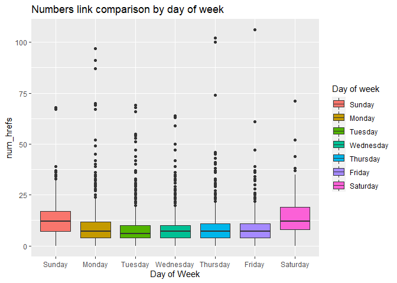
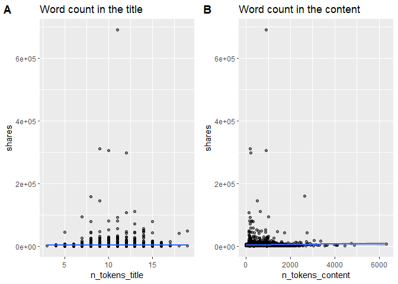
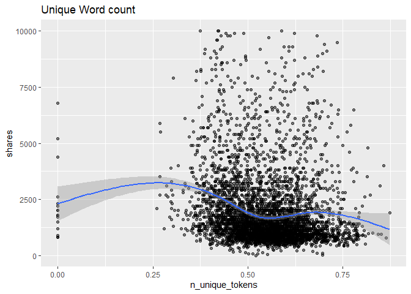
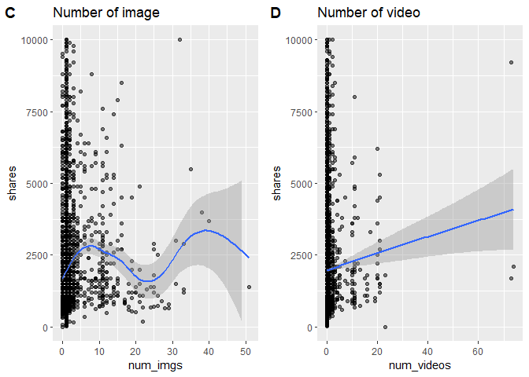
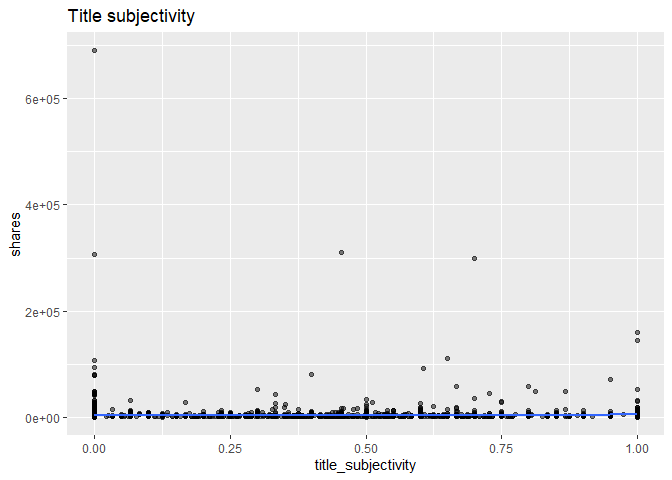
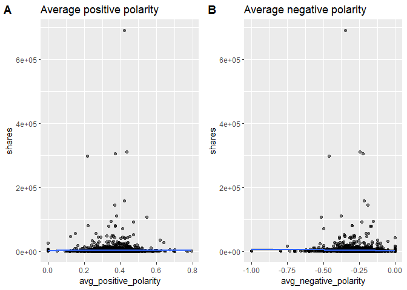

Bus
================

-   [Intro](#intro)
-   [Data manipulaton](#data-manipulaton)
-   [Summarizations](#summarizations)
    -   [Exploratory Data Anaysis](#exploratory-data-anaysis)
        -   [Shares by day of week](#shares-by-day-of-week)
        -   [Shares by popularity](#shares-by-popularity)
        -   [Count of news by popularity over different day of
            week](#count-of-news-by-popularity-over-different-day-of-week)
        -   [Shares by number of links](#shares-by-number-of-links)
        -   [Number of link by day of
            week](#number-of-link-by-day-of-week)
        -   [Number of words in the title and
            content](#number-of-words-in-the-title-and-content)
        -   [Unique words count](#unique-words-count)
        -   [Number of image and video](#number-of-image-and-video)
        -   [Number of keywords](#number-of-keywords)
        -   [Number of positive and negative words
            rate](#number-of-positive-and-negative-words-rate)
        -   [Title subjectivity](#title-subjectivity)
        -   [Number of average positive and negative
            polarity](#number-of-average-positive-and-negative-polarity)
        -   [Correlation with numeric
            variables](#correlation-with-numeric-variables)
-   [Modeling](#modeling)
    -   [Linear Regression](#linear-regression)
        -   [Linear model 1](#linear-model-1)
        -   [Linear model 2 - Logarithmic Linear
            Regression](#linear-model-2---logarithmic-linear-regression)
    -   [Ensemble Tree-based model](#ensemble-tree-based-model)
        -   [Random Forest Model](#random-forest-model)
        -   [Boosted Tree Model](#boosted-tree-model)
-   [Comparison](#comparison)

## Intro

This project aims at building predictive models on the [Online News
Popularity](https://archive.ics.uci.edu/ml/datasets/Online+News+Popularity#)
dataset. Our goal is to build models that predict the number of shares
an article receives based on characteristics of the article. This work
is important to help writers/companies understand factors that influence
article success (as measured by the number of shares an article
obtains). This work could also be integrated in the calculation of
advertisement space on articles (articles that receive more shares
should demand more for ad space).

The characteristics we will explore include:

-   `weekday`: day of week that article was published (Monday, Tuesday,
    …)
-   `num_hrefs`: number of links referenced in article
-   `num_imgs`: number of images in article
-   `num_videos`: number of videos in article
-   `n_tokens_title`: word count of title
-   `n_tokens_content`: word count of article
-   `n_unique_tokens`: number of unique words in article
-   `rate_positive_words` and `rate_negative_words`: rate of
    positive/negative words among non-neutral tokens
-   `title_subjectivity`: subjectivity of title
-   `avg_positive_polarity` and `avg_negative_polarity`: average
    polarity of positive/negative words in article

In the model building section, we explore 4 unique models: OLS,
logarithmic linear regression, random forest tree, and a boosted tree.
These models are trained using cross validation on a training dataset
that is 80% of the original dataset. These models are compared using
metric scores from results of predictions on test set.

Lastly, all summarizations and models are generated after splitting by
data channel. For example, on the lifestyle page, all EDA and model
building is using data that is filtered by articles that come from the
lifestyle channel. Splitting sections this way causes us to generalize
descriptions.

The following packages are required:

``` r
library(tidyverse)
library(corrplot)
library(caret)
library(gbm)
library(leaps)
library(caret)
library(cowplot)
```

## Data manipulaton

We read in the online news popularity data and subset the data by
data_channel_is\*(one of six groups).

``` r
# read entire dataset
  # subset to get the data channel we want
    # remove unnessary columns
df <- read_csv('data/OnlineNewsPopularity.csv') %>%
        filter((!!sym(paste0('data_channel_is_', params$channel))) == 1) %>%
          select(-contains('data_channel_is'))
```

    ## Rows: 39644 Columns: 61

    ## ── Column specification ────────────────────────────────────────────────────────────────────────────────
    ## Delimiter: ","
    ## chr  (1): url
    ## dbl (60): timedelta, n_tokens_title, n_tokens_content, n_unique_tokens, n_non_stop_words, n_non_stop...

    ## 
    ## ℹ Use `spec()` to retrieve the full column specification for this data.
    ## ℹ Specify the column types or set `show_col_types = FALSE` to quiet this message.

``` r
dim(df)
```

    ## [1] 6258   55

The object `df` now holds a subset of the data according to the
specified data channel. Now, we must create new features to consolidate
variables and prepare the dataset for exploratory data analysis:

``` r
# Create a variable that holds day of week
levels = c('Sunday', 'Monday', 'Tuesday', 'Wednesday','Thursday', 'Friday', 'Saturday')
df <- df %>% mutate(weekday = ifelse(weekday_is_monday==1, 'Monday', 
                                ifelse(weekday_is_tuesday==1, 'Tuesday',
                                ifelse(weekday_is_wednesday==1, 'Wednesday',
                                ifelse(weekday_is_thursday==1, 'Thursday', 
                                ifelse(weekday_is_friday==1, 'Friday',
                                ifelse(weekday_is_saturday==1, 'Saturday', 'Sunday'
                                       ))))))) %>%
                mutate(weekday = factor(weekday, levels = levels))


# function to create the popularity column. 
# popularity rating was created with summary stat info (25%, median, and 75%).
# popularity is going to use for EDA.
popularityCol <- function(dataset){
  dataset <- dataset %>% 
    mutate("Popularity" = if_else(shares > 2800, "Very popular",
                           if_else(shares > 1400, "Somewhat popular", 
                            if_else(shares > 946, "Not too popular", "Not at all popular")) 
                           )
    )            
  return(dataset)
}

# Data set using popularityCol function.
df <- popularityCol(df) %>% as_tibble()

# Overwrite popularity column with factor version
df$Popularity <- as.factor(df$Popularity)

# Use ordered function on a factor to order the levels
df$Popularity <- ordered(df$Popularity, levels = c("Not at all popular", "Not too popular", "Somewhat popular", "Very popular"))
```

We now split the data into train and test sets for predicitve modeling.

``` r
set.seed(123)
# split data into train and test sets
train_rows <- sample(nrow(df), nrow(df)*0.7)
trainData <- df[train_rows,]
testData <- df[-train_rows,] 
```

## Summarizations

### Exploratory Data Anaysis

We will use train set for EDA. Here is the summary statistics of
targeted variable (shares).

``` r
# summary statistics
share_stat <- trainData %>% 
                summarise(Count = n(),
                          Min = min(shares), 
                          Q1 = quantile(shares, 0.25),
                          Median = median(shares),
                          Average = mean(shares),
                          Q3 = quantile(shares, 0.75),
                          Max = max(shares),
                          Std.Dev = sd(shares)
                          )

# Display a table of the summary stats.
knitr::kable(share_stat, caption = "Summary Stats by shares", digits = 2)
```

| Count | Min |     Q1 | Median | Average |   Q3 |    Max |  Std.Dev |
|------:|----:|-------:|-------:|--------:|-----:|-------:|---------:|
|  4380 |   1 | 956.75 |   1400 | 3145.98 | 2500 | 690400 | 14601.32 |

Summary Stats by shares

#### Shares by day of week

``` r
# Summary statistics by day of week
trainData %>%
  group_by(weekday) %>%
  summarise(total_shares = sum(shares), avg_shares = round(mean(shares)), max_shares = max(shares)) %>%
  knitr::kable()
```

| weekday   | total_shares | avg_shares | max_shares |
|:----------|-------------:|-----------:|-----------:|
| Sunday    |       891579 |       3699 |      56900 |
| Monday    |      3007696 |       3769 |     690400 |
| Tuesday   |      2504815 |       3014 |     310800 |
| Wednesday |      2476437 |       2736 |     158900 |
| Thursday  |      2723881 |       3142 |     306100 |
| Friday    |      1314838 |       2327 |      92100 |
| Saturday  |       860168 |       4972 |     144400 |

The above table shows a breakdown of total, average, and maximum number
of shares for articles published on a specific weekday for this channel.
Some channels tend to have more popular days than others.

``` r
# histogram for day of week vs shares

trainData %>% ggplot(aes(x=weekday, y=shares)) +
        geom_bar(stat="identity", fill = "darkblue") + 
   theme(axis.text.x = element_text(angle = 45, vjust = .75)) +
        ggtitle('Day of Week and Total Number of Shares')
```

<!-- -->

While the summary statistic by day of week table shows the breakdown
information, the above bar plot visually shows a count of the total
number of shares for all articles published on each day of week. If the
total number of shares are generally higher during week days than
weekends, we can infer that people are less likely to involve in reading
and sharing the articles during the weekends and more likely to relax
and do more leisure activities.

#### Shares by popularity

``` r
# Summary statistics by popularity
trainData %>% 
  group_by(Popularity) %>%
  summarise(Total_shares = sum(shares), Avg_shares = round(mean(shares)),                     Median_shares = median(shares), IQR = IQR(shares)) %>%
  knitr::kable()
```

| Popularity         | Total_shares | Avg_shares | Median_shares |  IQR |
|:-------------------|-------------:|-----------:|--------------:|-----:|
| Not at all popular |       768047 |        726 |           752 |  227 |
| Not too popular    |      1399667 |       1171 |          1200 |  300 |
| Somewhat popular   |      2334800 |       1992 |          1900 |  600 |
| Very popular       |      9276900 |       9714 |          4600 | 3900 |

The above table show a summary of the newly created `popularity`
variable. If the average score is significantly higher than the median
score, and the IQR score is also large, then it means that the shares in
the specific level (i.e. Very Popular) are more spread out, but the
majority are still around the median scores.

#### Count of news by popularity over different day of week

``` r
#Bar plot of weekday by popularity 
ggplot(data = trainData, aes(x = weekday)) +
  geom_bar(aes(fill = as.factor(Popularity))) + 
  labs(x = "Days of week", 
       title = "Days of week by popularity") +
  theme(axis.text.x = element_text(angle = 45, hjust=1)) +
  scale_fill_discrete(name = "Popularity") 
```

<!-- -->

The bar plot above shows a breakdown of the number of articles published
vs day of week. We can also see a breakdown of the proportion of
popularity of articles for each day. This plot is important to
understand if a greater number of shares exhibited by a day of the week
is due to more articles being published on that day, or if it is due to
that day of week having a direct effect on the number of shares.

For example, if all days have the same number of ‘very popular’
articles, we could hypothesize that day of week does not have an effect
on producing ‘very popular’ articles.

#### Shares by number of links

``` r
# simple scatter plot
g2 <- trainData %>% ggplot(aes(x=num_hrefs, y=shares)) +
        geom_point(size=2, shape=23) +
        ylim(0, 10000) +
        ggtitle("Number of links") +
  geom_smooth(method = lm)
g2
```

<!-- -->

In the above scatter, we compare the number of links in an article to
its shares. This plot is motivated by the implementation of Google’s
[PageRank Algorithm](https://en.wikipedia.org/wiki/PageRank). If the
points show an upward trend, the articles with more number of links tend
to be more shared.

#### Number of link by day of week

``` r
# Box plot of number of link by day of week
ggplot(trainData, aes(x = weekday, 
                                y = num_hrefs, 
                                fill = weekday)
                            ) +
  geom_boxplot() +
  scale_x_discrete("Day of Week") +
  ggtitle("Numbers link comparison by day of week") +
  scale_fill_brewer(palette = "BuPu") +
  scale_fill_discrete(name = "Day of week") 
```

<!-- -->

In the above box plot, we look at how the number of link in an article
by day of week. When the median line of weekend are lower than weekday,
it shares similar pattern of shares that people tend to spend less time
reading articles and tend to link less during the weekends. However, if
the median line of the weekends are higher, then it infer different
story and we may infer that people are more likely to spend time and
make effort to link the articles during the weekends since shares are
easier to acquire than links.

#### Number of words in the title and content

``` r
# scatter plot of Number of words in the title
g3 <- ggplot(data = trainData, aes(x =  n_tokens_title, 
                      y = shares)) +
      geom_point(alpha = 0.50) + 
      ggtitle("Word count in the title") +
  geom_smooth(method = lm)


# scatter plot of Number of words in the content
g4 <- ggplot(data = trainData, aes(x =  n_tokens_content, 
                      y = shares)) +
      geom_point(alpha = 0.50) + 
  #theme(axis.text.x = element_text(angle = 45, hjust = 1)) + 
      ggtitle("Word count in the content") +
  geom_smooth(method = lm)

plot_grid(g3, g4,  labels = c('A', 'B'))   
```

<!-- -->

Scatter plot A shows the number of words in the title compared to the
number of shares. Scatter plot B shows a comparison of the number of
words that appear in the article compared to the number of shares. These
information will be very useful for the writers because people tend to
read articles based on the catch title and length of the articles. If a
bell shape appears in the plot A, we can embrace the idea that articles
with not too long or short number of words in title are more shared and
perhaps a quadratic relationship is appropriate for this variable. Also,
in plot B, if the data exhibits a slightly negative slops, we can infer
that people tend to share more articles with shorter contents and
perhaps a negative linear relationship is appropriate.

#### Unique words count

``` r
# scatter plot of Unique words count
ggplot(data = trainData, aes(x =  n_unique_tokens, 
                      y = shares)) +
      geom_point(alpha = 0.50) + 
  #theme(axis.text.x = element_text(angle = 45, hjust = 1)) + 
      ggtitle("Unique Word count") +
      ylim(0, 10000) 
```

<!-- -->

``` r
  geom_smooth(method = lm)
```

    ## geom_smooth: na.rm = FALSE, orientation = NA, se = TRUE
    ## stat_smooth: na.rm = FALSE, orientation = NA, se = TRUE, method = function (formula, data, subset, weights, na.action, method = "qr", model = TRUE, x = FALSE, y = FALSE, qr = TRUE, singular.ok = TRUE, contrasts = NULL, offset, ...) 
    ## {
    ##     ret.x <- x
    ##     ret.y <- y
    ##     cl <- match.call()
    ##     mf <- match.call(expand.dots = FALSE)
    ##     m <- match(c("formula", "data", "subset", "weights", "na.action", "offset"), names(mf), 0)
    ##     mf <- mf[c(1, m)]
    ##     mf$drop.unused.levels <- TRUE
    ##     mf[[1]] <- quote(stats::model.frame)
    ##     mf <- eval(mf, parent.frame())
    ##     if (method == "model.frame") 
    ##         return(mf)
    ##     else if (method != "qr") 
    ##         warning(gettextf("method = '%s' is not supported. Using 'qr'", method), domain = NA)
    ##     mt <- attr(mf, "terms")
    ##     y <- model.response(mf, "numeric")
    ##     w <- as.vector(model.weights(mf))
    ##     if (!is.null(w) && !is.numeric(w)) 
    ##         stop("'weights' must be a numeric vector")
    ##     offset <- model.offset(mf)
    ##     mlm <- is.matrix(y)
    ##     ny <- if (mlm) 
    ##         nrow(y)
    ##     else length(y)
    ##     if (!is.null(offset)) {
    ##         if (!mlm) 
    ##             offset <- as.vector(offset)
    ##         if (NROW(offset) != ny) 
    ##             stop(gettextf("number of offsets is %d, should equal %d (number of observations)", NROW(offset), ny), domain = NA)
    ##     }
    ##     if (is.empty.model(mt)) {
    ##         x <- NULL
    ##         z <- list(coefficients = if (mlm) matrix(NA, 0, ncol(y)) else numeric(), residuals = y, fitted.values = 0 * y, weights = w, rank = 0, df.residual = if (!is.null(w)) sum(w != 0) else ny)
    ##         if (!is.null(offset)) {
    ##             z$fitted.values <- offset
    ##             z$residuals <- y - offset
    ##         }
    ##     }
    ##     else {
    ##         x <- model.matrix(mt, mf, contrasts)
    ##         z <- if (is.null(w)) 
    ##             lm.fit(x, y, offset = offset, singular.ok = singular.ok, ...)
    ##         else lm.wfit(x, y, w, offset = offset, singular.ok = singular.ok, ...)
    ##     }
    ##     class(z) <- c(if (mlm) "mlm", "lm")
    ##     z$na.action <- attr(mf, "na.action")
    ##     z$offset <- offset
    ##     z$contrasts <- attr(x, "contrasts")
    ##     z$xlevels <- .getXlevels(mt, mf)
    ##     z$call <- cl
    ##     z$terms <- mt
    ##     if (model) 
    ##         z$model <- mf
    ##     if (ret.x) 
    ##         z$x <- x
    ##     if (ret.y) 
    ##         z$y <- y
    ##     if (!qr) 
    ##         z$qr <- NULL
    ##     z
    ## }
    ## position_identity

Above, we see a plot of the number of unique words in each article
compared to the number of shares. Across channels, there does not seem
to be a strong linear correlation between these two variables. However,
this variable may have significance in tree based models.

#### Number of image and video

``` r
# scatter plot of Number of words in the content
g5 <- ggplot(data = trainData, aes(x =  num_imgs, 
                      y = shares)) +
      geom_point(alpha = 0.50) +
      ggtitle("Number of image") +
      ylim(0, 10000) +
      geom_smooth(method = lm)

# Scatter plot of Number of words in the content
g6 <- ggplot(data = trainData, aes(x =  num_videos, 
                      y = shares)) +
      geom_point(alpha = 0.50) + 
      ggtitle("Number of video") +
      ylim(0, 10000)+
      geom_smooth(method = lm)

plot_grid(g5, g6,  labels = c('C', 'D')) 
```

    ## `geom_smooth()` using formula 'y ~ x'
    ## `geom_smooth()` using formula 'y ~ x'

<!-- -->

In these scatter plots, we compare the number of images/videos to the
number of shares. As a reader, when I see interesting images and videos
in the article, I have tendency to read and share the articles. However,
it may be depending on the topic of the article or numbers of
images/videos. If the points display positive trend, then the articles
with more images/ videos tend to be shared more. Contrarily, if the
points display downward trend, then the articles with more images/
videos tend to be shared less.

#### Number of keywords

``` r
# Scatter plot of number of keywords
ggplot(data = trainData, aes(x =  num_keywords, 
                      y = shares)) +
      geom_point(alpha = 0.50) + 
      ggtitle("Number of keywords") +
  geom_smooth(method = lm)
```

    ## `geom_smooth()` using formula 'y ~ x'

<!-- -->

In above plot, we compare the number of keywords that appear in an
article to the number of shares. Across channels, there does not appear
to be much linear correlation between the two variables. In other words,
the number of keywords may not be the significant factor to the readers,
but may be the topic or the name of the keywords are more important
aspect since readers often search keywords of their interests to find
articles.

#### Number of positive and negative words rate

``` r
# Scatter plot of positive words rate
g7 <- ggplot(data = trainData, aes(x =  rate_positive_words, 
                      y = shares)) +
      geom_point(alpha = 0.50) +
      ggtitle("Positive words rate") +
    geom_smooth()


# Scatter plot of and negative words rate
g8 <- ggplot(data = trainData, aes(x =  rate_negative_words, 
                      y = shares)) +
      geom_point(alpha = 0.50) +
      ggtitle("Negative words rate") +
    geom_smooth()

plot_grid(g7, g8,  labels = c('A', 'B')) 
```

    ## `geom_smooth()` using method = 'gam' and formula 'y ~ s(x, bs = "cs")'
    ## `geom_smooth()` using method = 'gam' and formula 'y ~ s(x, bs = "cs")'

<!-- -->

In above scatter plots, we compare the positive/negative rate of words
that appear in an article to the number of shares of an article. If the
positive relationships show in each plot, then articles with more
positive or negative rate of words tend to be shared more frequently.
Vice versa, if the negative relationships show in each plot, then
articles with more positive or negative rate of words tend to be shared
less frequently. Across channels, there seems to be a slight positive
correlation between positive words rate and shares. Additionally, there
seems to be a slight negative correlation between negative words rate
and shares. The results tells that people are more likely to share
articles with positive words.

#### Title subjectivity

``` r
# Scatter plot of title subjectivity
ggplot(data = trainData, aes(x =     title_subjectivity, 
                      y = shares)) +
      geom_point(alpha = 0.50) +
      ggtitle("Title subjectivity")
```

<!-- -->

In the title subjectivity scatter plot, we compare title subjectivity to
the number of shares. Across channels, there does not seem to be a
strong linear correlation between the two variables. Based on the
results, we infer that the subjectivity (such as tone of voice and
emotions) in the title may not influence people in terms of sharing
articles.

#### Number of average positive and negative polarity

``` r
# Scatter plot of average positive polarity
g9 <- ggplot(data = trainData, aes(x =  avg_positive_polarity, 
                      y = shares)) +
      geom_point(alpha = 0.50) +
      ggtitle("Average positive polarity") +
      geom_smooth(method = lm)

# Scatter plot of average negative polarity
g10 <- ggplot(data = trainData, aes(x =  avg_negative_polarity, 
                      y = shares)) +
      geom_point(alpha = 0.50) +
      ggtitle("Average negative polarity") +
      geom_smooth(method = lm)

plot_grid(g9, g10,  labels = c('A', 'B')) 
```

    ## `geom_smooth()` using formula 'y ~ x'
    ## `geom_smooth()` using formula 'y ~ x'

<!-- -->

In the above plots, we compare the average polarity of positive/negative
words that appear in the article to the number of shares. If there is a
positive relationship between the average positive polarity and the
number of shares, then articles with more positive polarity tend to be
shared more frequently. Yet, if there is a negative relationship between
the two variables, then articles with more positive polarity are less
likely to be shared. Same interpretation applied to the relationship
between average negative polarity and the number of shares that
depending on the positive or negative trend, articles with more
negiative polarity tend to be shared more often or less likely.
“Polarity” conveys the idea that words have a very strong opinion.
Therefore, higher average positive polarity refers that articles carry
extreme positive opinions.

#### Correlation with numeric variables

``` r
# Correlation plot
df_tmp <- trainData %>% select(c('n_tokens_title', 
                          'n_tokens_content',
                          'n_unique_tokens',
                          'num_hrefs',
                          'num_imgs',
                          'num_videos',
                          'num_keywords',
                          'is_weekend',
                          'rate_positive_words',
                          'rate_negative_words',
                          'title_subjectivity',
                          'avg_positive_polarity',
                          'avg_negative_polarity',
                          'shares',))
corrplot(cor(df_tmp), type = 'lower', diag = FALSE)
```

<!-- -->

Above shows the correlation matrix for the numerical variables we
explore in EDA. Shares is the bottom row. We use this plot to find the
variables that might have weak correlation with shares and make sure to
include these in our model building phase.

## Modeling

### Linear Regression

Linear regression is one of the commonly used supervised methods for
modeling and useful tool for predicting a quantitative response on the
basis of a single or multiple predictor variables. The idea of linear
regression is that the model finds the best fit line between predictor
variables and response variable, minimizing sum of squared errors. Also,
Linear Regression is flexible in which to include many explanatory
variables, higher order terms, and/or interaction, so we can see the
effect the combinations on prediction. Here we will fit two different
linear regression models.

#### Linear model 1

The first linear regression model will have predictors selected by
stepwise selection. After choosing the subset of predictors, we will use
repeated cross-validation with 10 folder and will find the RMSE and R2.

``` r
# Stepwise model selection
lmFitSelect <- lm(shares ~ n_tokens_title + n_tokens_content+ is_weekend +
                    num_hrefs + num_imgs + num_videos + num_keywords +
                    rate_positive_words + title_subjectivity +
                    I(n_tokens_content^2) + I(num_imgs^2) + I(num_videos^2) +
                    I(num_hrefs^2) + is_weekend, 
                  data = trainData)
models <- step(lmFitSelect, trace=0)
summary(models)
```

    ## 
    ## Call:
    ## lm(formula = shares ~ is_weekend + num_imgs + num_videos + rate_positive_words + 
    ##     I(num_videos^2) + I(num_hrefs^2), data = trainData)
    ## 
    ## Residuals:
    ##    Min     1Q Median     3Q    Max 
    ## -16764  -1854  -1245   -347 679635 
    ## 
    ## Coefficients:
    ##                       Estimate Std. Error t value Pr(>|t|)    
    ## (Intercept)          3783.2737  1127.3149   3.356 0.000798 ***
    ## is_weekend           1087.3823   751.5767   1.447 0.148024    
    ## num_imgs              161.5774    66.3062   2.437 0.014856 *  
    ## num_videos            863.4034   136.6214   6.320 2.88e-10 ***
    ## rate_positive_words -2175.6756  1491.5571  -1.459 0.144730    
    ## I(num_videos^2)       -11.4750     2.3340  -4.916 9.14e-07 ***
    ## I(num_hrefs^2)          1.0414     0.4603   2.262 0.023721 *  
    ## ---
    ## Signif. codes:  0 '***' 0.001 '**' 0.01 '*' 0.05 '.' 0.1 ' ' 1
    ## 
    ## Residual standard error: 14500 on 4373 degrees of freedom
    ## Multiple R-squared:  0.01463,    Adjusted R-squared:  0.01328 
    ## F-statistic: 10.82 on 6 and 4373 DF,  p-value: 5.493e-12

``` r
# get all numeric columns
train_df <- trainData[ ,unlist(lapply(trainData, is.numeric))]
test_df <- testData[ ,unlist(lapply(testData, is.numeric))]

# train data with variables chosen by stepWise
set.seed(10)
lm.fit1 <- train(shares ~ num_imgs + num_videos + rate_positive_words +
                   I(num_videos^2) + I(num_hrefs^2), 
                 data = train_df,
                 method="lm",
                 preProcess = c("center","scale"),
                 trControl = trainControl(method = "repeatedcv", 
                                          number = 10, 
                                          repeats = 3))

lm.fit1
```

    ## Linear Regression 
    ## 
    ## 4380 samples
    ##    4 predictor
    ## 
    ## Pre-processing: centered (5), scaled (5) 
    ## Resampling: Cross-Validated (10 fold, repeated 3 times) 
    ## Summary of sample sizes: 3943, 3941, 3942, 3941, 3943, 3943, ... 
    ## Resampling results:
    ## 
    ##   RMSE      Rsquared    MAE     
    ##   11788.26  0.01324197  2862.622
    ## 
    ## Tuning parameter 'intercept' was held constant at a value of TRUE

#### Linear model 2 - Logarithmic Linear Regression

Now, let’s look at regresssing on the log-transformed target variable of
shares.

``` r
# get all numeric columns
train_df <- trainData[ ,unlist(lapply(trainData, is.numeric))]
test_df <- testData[ ,unlist(lapply(testData, is.numeric))]

# code used to get regression variables
## fit using forward selection
#forward <- regsubsets(log(shares) ~ .,
#                      data = train_df,
#                      nvmax = 10,
#                      method = "forward")
## summary
#mod_summary <- summary(forward)

# train model
lm.fit2 <- train(log(shares) ~ n_tokens_content + num_hrefs + average_token_length + 
                        num_keywords + kw_min_min + kw_max_avg + kw_avg_avg + 
                        is_weekend + LDA_04 + global_subjectivity, 
                        data = train_df,
                        method="lm",
                        preProcess = c("center","scale"),
                        trControl = trainControl(method = "repeatedcv", 
                                                 number = 10, 
                                                 repeats = 3))

lm.fit2
```

    ## Linear Regression 
    ## 
    ## 4380 samples
    ##   10 predictor
    ## 
    ## Pre-processing: centered (10), scaled (10) 
    ## Resampling: Cross-Validated (10 fold, repeated 3 times) 
    ## Summary of sample sizes: 3941, 3941, 3942, 3943, 3944, 3942, ... 
    ## Resampling results:
    ## 
    ##   RMSE       Rsquared   MAE      
    ##   0.7846534  0.1587721  0.5608561
    ## 
    ## Tuning parameter 'intercept' was held constant at a value of TRUE

### Ensemble Tree-based model

Tree-based method splits up response variable into subsets based on
their relationship to one or more predictor variables. Because it is
easy to understand and interpret output and no statistical assumptions
is necessary, regression tree (continuous variable) and classification
tree (group membership) are commonly used. However, these models are
influenced vastly even there is a small changes in the data. Therefore,
Ensemble tree-based model are highly used in machine learning to gain
strong prediction even though it loses interpretability because it gets
rid of variation of data set to data set and average of predication for
a final prediction. In this project, we will use the two of most
commonly used ensemble methods: Random Forests and Boosting.

#### Random Forest Model

Random Forest method, which shares the idea of bagging, but extends the
idea and only include random subset of predictors for each bootstrap
sample/tree fit instead of including every predictor in each of the
tree. In doing so, one or two good predictors won’t dominate the tree
fit. Random forest method use mtry as tuning parameter and the number of
randomly selected predictor is obtained using *m* = *p*/3 formula (p as
the number of predictors). Below, you will see the result of training
with the random forest method. By choosing randomly selected subset of
predictors in each tree, we will possibly reduce the correlation and
gain stronger prediction.

``` r
# get all numeric columns
train_df <- trainData[ ,unlist(lapply(trainData, is.numeric))]
test_df <- testData[ ,unlist(lapply(testData, is.numeric))]

# tuning parameter is mtry, use values of 1,2,..,10
rfFit <- train(shares ~ n_tokens_title + n_tokens_content+
                 n_unique_tokens+avg_positive_polarity+
                 avg_negative_polarity + num_hrefs +  num_imgs +
                 num_videos + num_keywords + title_sentiment_polarity +
                 rate_positive_words + rate_negative_words +
                 title_subjectivity + is_weekend,
                 data = train_df, 
                 method = "rf", 
                 trControl = trainControl(method = "cv", number = 5),
                 preProcess = c("center", "scale"),
                 tuneGrid = data.frame(mtry = (1:3)))
rfFit
```

    ## Random Forest 
    ## 
    ## 4380 samples
    ##   14 predictor
    ## 
    ## Pre-processing: centered (14), scaled (14) 
    ## Resampling: Cross-Validated (5 fold) 
    ## Summary of sample sizes: 3505, 3503, 3504, 3504, 3504 
    ## Resampling results across tuning parameters:
    ## 
    ##   mtry  RMSE      Rsquared     MAE     
    ##   1     13370.01  0.007567647  2852.272
    ##   2     13597.30  0.005813041  3007.000
    ##   3     13933.88  0.004411594  3128.866
    ## 
    ## RMSE was used to select the optimal model using the smallest value.
    ## The final value used for the model was mtry = 1.

``` r
# Re-train using best hyperparameter value
rfFit <- train(shares ~ n_tokens_title + n_tokens_content+
                 n_unique_tokens+avg_positive_polarity+
                 avg_negative_polarity + num_hrefs +  num_imgs +
                 num_videos + num_keywords + title_sentiment_polarity +
                 rate_positive_words + rate_negative_words +
                 title_subjectivity,
                 data = train_df, 
                 method = "rf", 
                 trControl = trainControl(method = "cv", number = 5),
                 preProcess = c("center", "scale"),
                 tuneGrid = data.frame(rfFit$bestTune))
rfFit
```

    ## Random Forest 
    ## 
    ## 4380 samples
    ##   13 predictor
    ## 
    ## Pre-processing: centered (13), scaled (13) 
    ## Resampling: Cross-Validated (5 fold) 
    ## Summary of sample sizes: 3505, 3504, 3504, 3504, 3503 
    ## Resampling results:
    ## 
    ##   RMSE      Rsquared     MAE     
    ##   13188.98  0.008890663  2879.009
    ## 
    ## Tuning parameter 'mtry' was held constant at a value of 1

#### Boosted Tree Model

The boosted tree is another tree-based regression model. This model aims
to predict the residuals between the number of shares (target variable)
of each observation and the average number of shares. To do this, the
model builds smaller trees of specified depth that add/subtract to
predictions with the hope that predictions move closer to their residual
values. To prevent overfitting of data, trees are constricted to a
‘shrinkage’ parameter (that takes a value between 0 and 1) which limits
the amount of boosting on predictions.

For a really good video explanation, watch
[this](https://www.youtube.com/watch?v=3CC4N4z3GJc).

``` r
# get all numeric columns
train_df <- trainData[ ,unlist(lapply(trainData, is.numeric))]
test_df <- testData[ ,unlist(lapply(testData, is.numeric))]

# declare grid of values to test in cross validation
## code retrieved from https://topepo.github.io/caret/model-training-and-tuning.html
gbmGrid <-  expand.grid(interaction.depth = c(1, 5, 9), # complexity of tree
                        n.trees = c(25, 50, 100, 150, 200), # number of iterations (i.e. trees)
                        shrinkage = 0.1, # learning rate
                        n.minobsinnode = 20) # minimum number of samples in a node to commence splitting

# train using crossvalidation, print out best fitting parameters
boostFit <- train(shares ~ .,
                data = train_df,
                method = "gbm",
                trControl = trainControl("cv", number = 5),
                verbose = FALSE,
                tuneGrid = gbmGrid
                )
boostFit
```

    ## Stochastic Gradient Boosting 
    ## 
    ## 4380 samples
    ##   53 predictor
    ## 
    ## No pre-processing
    ## Resampling: Cross-Validated (5 fold) 
    ## Summary of sample sizes: 3503, 3504, 3504, 3505, 3504 
    ## Resampling results across tuning parameters:
    ## 
    ##   interaction.depth  n.trees  RMSE      Rsquared    MAE     
    ##   1                   25      12852.36  0.02341590  2878.357
    ##   1                   50      13013.47  0.02102893  2961.765
    ##   1                  100      13095.54  0.01864372  2991.210
    ##   1                  150      13082.17  0.01977425  2959.315
    ##   1                  200      13106.08  0.02284468  2985.821
    ##   5                   25      12814.90  0.03756190  2868.985
    ##   5                   50      12895.21  0.03653894  2885.755
    ##   5                  100      13069.21  0.03534317  2999.694
    ##   5                  150      13170.55  0.03878785  3059.664
    ##   5                  200      13232.50  0.04035895  3104.337
    ##   9                   25      12881.64  0.03029232  2850.327
    ##   9                   50      12995.93  0.02687063  2913.235
    ##   9                  100      13157.40  0.02452744  3082.875
    ##   9                  150      13273.66  0.02750427  3159.341
    ##   9                  200      13440.51  0.02292434  3245.545
    ## 
    ## Tuning parameter 'shrinkage' was held constant at a value of 0.1
    ## Tuning parameter 'n.minobsinnode'
    ##  was held constant at a value of 20
    ## RMSE was used to select the optimal model using the smallest value.
    ## The final values used for the model were n.trees = 25, interaction.depth = 5, shrinkage = 0.1
    ##  and n.minobsinnode = 20.

``` r
# Re-train using best hyperparameter value
boostFit <- train(shares ~ .,
                data = train_df,
                method = "gbm",
                trControl = trainControl("cv", number = 5),
                verbose = FALSE,
                tuneGrid = expand.grid(boostFit$bestTune)
                )
boostFit
```

    ## Stochastic Gradient Boosting 
    ## 
    ## 4380 samples
    ##   53 predictor
    ## 
    ## No pre-processing
    ## Resampling: Cross-Validated (5 fold) 
    ## Summary of sample sizes: 3505, 3503, 3505, 3503, 3504 
    ## Resampling results:
    ## 
    ##   RMSE      Rsquared    MAE     
    ##   12178.72  0.02587375  2830.816
    ## 
    ## Tuning parameter 'n.trees' was held constant at a value of 25
    ## Tuning parameter 'interaction.depth'
    ##  was held constant at a value of 5
    ## Tuning parameter 'shrinkage' was held constant at a value of
    ##  0.1
    ## Tuning parameter 'n.minobsinnode' was held constant at a value of 20

## Comparison

Now, we compare the 4 models developed above. Each model was evaluated
on a test data set and Root MSE values(roof of test prediction error)
were compared.

``` r
# Predict on test data
predLm1 <- predict(lm.fit1, newdata = test_df)
predLm2 <- predict(lm.fit2, newdata = test_df)
rfPred <- predict(rfFit, newdata = test_df)
boostPred <- predict(boostFit, newdata = test_df)

# Calculate rmse
rmseLm1 <- sqrt(mean((predLm1 - test_df$shares)^2))
rmseLm2 <- sqrt(mean((predLm2 - test_df$shares)^2))
rfMSE <- sqrt(mean((rfPred - test_df$shares)^2))
boostRMSE <- sqrt(mean((boostPred - test_df$shares)^2))

rmseTotal <- data.frame('Linear Regression Model 1' = rmseLm1, 
                   'Linear Regression Model 2' = rmseLm2, 
                   'Random Forest Model' = rfMSE, 
                   'Boosting Model' = boostRMSE)

knitr::kable(t(rmseTotal),
               digits=3,
               caption="Summary Table of RMSE score",
               col.names = "RMSE")
```

|                           |     RMSE |
|:--------------------------|---------:|
| Linear.Regression.Model.1 | 16073.83 |
| Linear.Regression.Model.2 | 16288.01 |
| Random.Forest.Model       | 16083.94 |
| Boosting.Model            | 15962.27 |

Summary Table of RMSE score

``` r
winningModel <- ifelse((rmseLm1 < rmseLm2) & (rmseLm1 < rfMSE) & (rmseLm1 < boostRMSE), 'Linear Model 1', 
       ifelse((rmseLm2 < rfMSE) & (rmseLm2 < boostRMSE), 'Linear Model 2',
       ifelse(rfMSE < boostRMSE, 'Random Forest', 'Boosted Tree')))
lowestrmse <- min(rmseLm1, rmseLm2, rfMSE, boostRMSE)
paste('The Winning Model is:', paste0(winningModel, '!'), 'Its RMSE value is', round(lowestrmse, 2))
```

    ## [1] "The Winning Model is: Boosted Tree! Its RMSE value is 15962.27"
