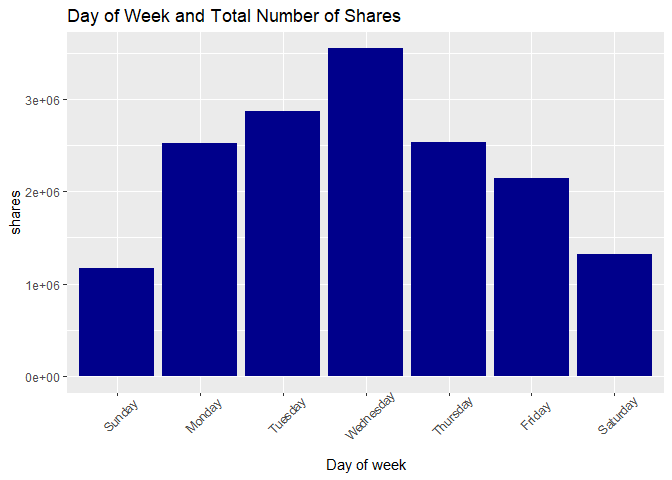
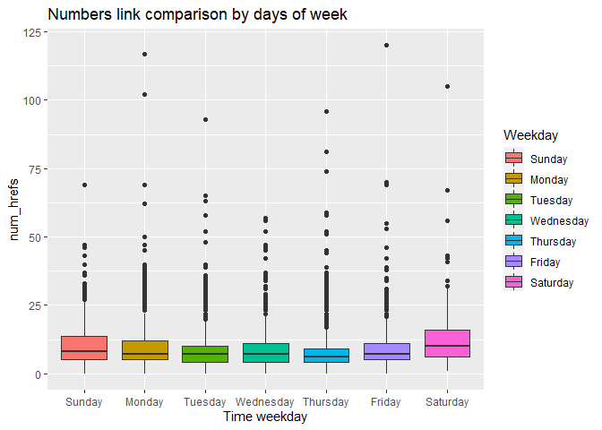
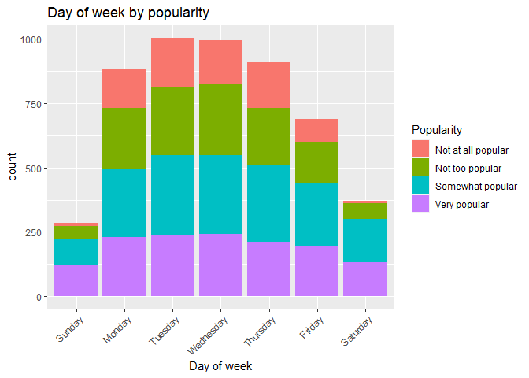
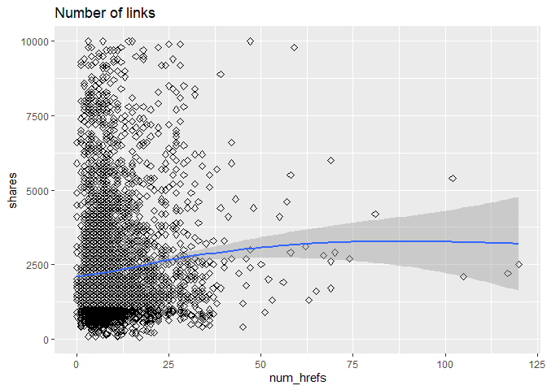
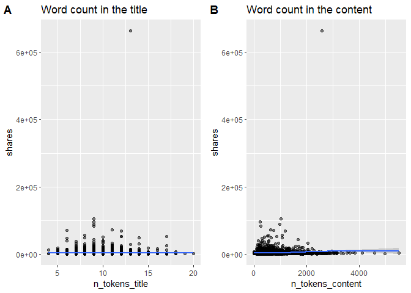
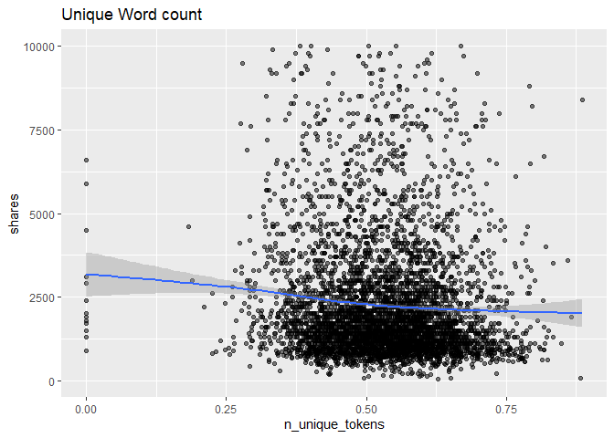
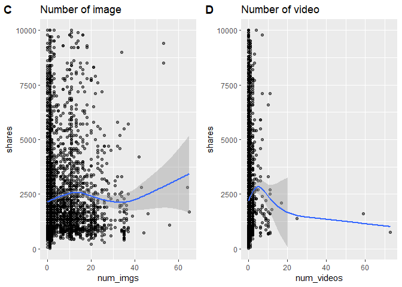

Tech
================

-   [Intro](#intro)
-   [Requirements](#requirements)
-   [Data manipulaton](#data-manipulaton)
    -   [Read in Data](#read-in-data)
-   [Summarizations](#summarizations)
    -   [Exploratory Data Anaysis](#exploratory-data-anaysis)
    -   [Shares by days of week](#shares-by-days-of-week)
    -   [shares by popularity](#shares-by-popularity)
    -   [count of news by popularity over different days of
        week](#count-of-news-by-popularity-over-different-days-of-week)
    -   [Days of week](#days-of-week)
    -   [Number of links](#number-of-links)
    -   [Number of words in the title and
        content](#number-of-words-in-the-title-and-content)
    -   [Unique words count](#unique-words-count)
    -   [Number of image and video](#number-of-image-and-video)
    -   [Number of positive and negative words
        rate](#number-of-positive-and-negative-words-rate)
    -   [Title subjectivity](#title-subjectivity)
    -   [Number of positive and negative words
        rate](#number-of-positive-and-negative-words-rate-1)
    -   [Correlation with numeric
        variables](#correlation-with-numeric-variables)
-   [Modeling](#modeling)
    -   [Linear Regression](#linear-regression)
    -   [Ensemble Tree](#ensemble-tree)
-   [Comparison](#comparison)

## Intro

This project aims at building predictive models on the [Online News
Popularity](https://archive.ics.uci.edu/ml/datasets/Online+News+Popularity#)
dataset. Our goal is to build models that predict the number of shares
an article receives based on characteristics of the article. This work
is important to help writers/companies understand factors that influence
article success (as measured by the number of shares an article
obtains). This work could also be integrated in the calculation of
advertisement space on articles (articles that receive more shares
should demand more for ad space).

The characteristics we will explore include day of week, number of
links, word count of title, word count of content

-   `weekday`: day of week that article was published (Monday, Tuesday,
    …)
-   `num_hrefs`: number of links referenced in article
-   `n_tokens_title`: word count of title
-   `n_tokens_content`: word count of article
-   `rate_positive_words` and `rate_negative_words`: rate of
    positive/negative words among non-neutral tokens

The models used to build … continue from here Data was split by channel
type…

## Requirements

``` r
library(tidyverse)
library(corrplot)
```

## Data manipulaton

### Read in Data

``` r
# read entire dataset
  # subset to get the data channel we want
    # remove unnessary columns
df <- read_csv('data/OnlineNewsPopularity.csv') %>%
        filter((!!sym(paste0('data_channel_is_', params$channel))) == 1) %>%
          select(-contains('data_channel_is'))
```

    ## Rows: 39644 Columns: 61

    ## -- Column specification ---------------------------------------------------------------------------------------------------------------------------------------
    ## Delimiter: ","
    ## chr  (1): url
    ## dbl (60): timedelta, n_tokens_title, n_tokens_content, n_unique_tokens, n_non_stop_words, n_non_stop_unique_tokens, num_hrefs, num_self_hrefs, num_imgs, nu...

    ## 
    ## i Use `spec()` to retrieve the full column specification for this data.
    ## i Specify the column types or set `show_col_types = FALSE` to quiet this message.

``` r
dim(df)
```

    ## [1] 7346   55

The object `df` now holds a subset of the data according to the
specified data channel. Now, we must create new features to consolidate
variables and prepare the dataset for exploratory data analysis:

``` r
# Create a variable that holds day of week
levels = c('Sunday', 'Monday', 'Tuesday', 'Wednesday','Thursday', 'Friday', 'Saturday')
df <- df %>% mutate(weekday = ifelse(weekday_is_monday==1, 'Monday', 
                                ifelse(weekday_is_tuesday==1, 'Tuesday',
                                ifelse(weekday_is_wednesday==1, 'Wednesday',
                                ifelse(weekday_is_thursday==1, 'Thursday', 
                                ifelse(weekday_is_friday==1, 'Friday',
                                ifelse(weekday_is_saturday==1, 'Saturday', 'Sunday'
                                       ))))))) %>%
                mutate(weekday = factor(weekday, levels = levels))


# function to create the popularity column. 
# popularity rating was created with summary stat info (25%, median, and 75%)
popularityCol <- function(dataset){
  dataset <- dataset %>% 
    mutate("Popularity" = if_else(shares > 2800, "Very popular",
                           if_else(shares > 1400, "Somewhat popular", 
                            if_else(shares > 946, "Not too popular", "Not at all popular")) 
                           )
    )            
  return(dataset)
}

# Data set using popularityCol function.
df <- popularityCol(df) %>% as_tibble()

# Overwrite popularity column with factor version
df$Popularity <- as.factor(df$Popularity)

# Use ordered function on a factor to order the levels
df$Popularity <- ordered(df$Popularity, levels = c("Not at all popular", "Not too popular", "Somewhat popular", "Very popular"))


# Deleting variables
#df <- df[-1:2, 34:38]
```

Our data set contains 30 000 instances; each consists of 60 attributes
and one dependent variable, the number of shares of the article.

The following variables can be omitted:

url: URL of the article (non-predictive) timedelta: Days between the
article publication and the dataset acquisition (non-predictive) five
LDA variables is\_weekend, since it seems to be duplicating days of week
kw\_min\_min, kw\_avg\_min, kw\_min\_avg have a number of negative
values

We now split the data into train and test sets for predicitve modeling.

``` r
set.seed(123)
# split data into train and test sets
train_rows <- sample(nrow(df), nrow(df)*0.7)
trainData <- df[train_rows,]
testData <- df[-train_rows,] 
```

## Summarizations

### Exploratory Data Anaysis

The summary statistics of targeted variable (shares)

``` r
# summary statistics
share_stat <- df %>% 
                summarise(Count = n(),
                          Min = min(shares), 
                          Q1 = quantile(shares, 0.25),
                          Median = median(shares),
                          Average = mean(shares),
                          Q3 = quantile(shares, 0.75),
                          Max = max(shares),
                          Std.Dev = sd(shares)
                          )

# Display a table of the summary stats.
knitr::kable(share_stat, caption = "Summary Stats by shares", digits = 2)
```

| Count | Min |   Q1 | Median | Average |   Q3 |    Max | Std.Dev |
|------:|----:|-----:|-------:|--------:|-----:|-------:|--------:|
|  7346 |  36 | 1100 |   1700 | 3072.28 | 3000 | 663600 | 9024.34 |

Summary Stats by shares

### Shares by days of week

``` r
df %>%
  group_by(weekday) %>%
  summarise(total_shares = sum(shares), avg_shares = round(mean(shares)), max_shares = max(shares)) %>%
  knitr::kable()
```

| weekday   | total\_shares | avg\_shares | max\_shares |
|:----------|--------------:|------------:|------------:|
| Sunday    |       1558532 |        3936 |       83300 |
| Monday    |       3484532 |        2821 |       51000 |
| Tuesday   |       4250146 |        2883 |       88500 |
| Wednesday |       4765065 |        3363 |      663600 |
| Thursday  |       3595351 |        2745 |       55200 |
| Friday    |       3017254 |        3051 |      104100 |
| Saturday  |       1898113 |        3615 |       96100 |

The above table shows a breakdown of total, average, and maximum number
of shares for articles published on a specific weekday for this channel.
Some channels tend to have more popular days than others.

### shares by popularity

``` r
df %>% 
  group_by(Popularity) %>%
  summarise(total_shares = sum(shares), avg_shares = round(mean(shares)), max_shares = max(shares)) %>%
  knitr::kable()
```

| Popularity         | total\_shares | avg\_shares | max\_shares |
|:-------------------|--------------:|------------:|------------:|
| Not at all popular |        864550 |         741 |         946 |
| Not too popular    |       2168243 |        1191 |        1400 |
| Somewhat popular   |       4801100 |        2015 |        2800 |
| Very popular       |      14735100 |        7457 |      663600 |

The above table show a summary of the newly created `popularity`
variable.

### count of news by popularity over different days of week

``` r
#Bar plot of weekday by popularity 

ggplot(data = df, aes(x = weekday)) +
  geom_bar(aes(fill = as.factor(Popularity))) + 
  labs(x = "Days of week", 
       title = "Days of week by popularity") +
  theme(axis.text.x = element_text(angle = 45, hjust=1)) +
  scale_fill_discrete(name = "Popularity") 
```

<!-- -->

The bar plot above shows a breakdown of the number of articles published
vs day of week. We can also see a breakdown of the proportion of
popularity of articles for each day. This plot is important to
understand if a greater number of shares exhibited by a day of the week
is due to more articles being published on that day, or if it is due to
that day of week having a direct effect on the number of shares.

For example, if all days have the same number of ‘very popular’
articles, we could hypothesize that day of week does not have an effect
on producing ‘very popular’ articles.

### Days of week

``` r
# histogram for day of week vs shares

g1 <- df %>% ggplot(aes(x=weekday, y=shares)) +
        geom_bar(stat="identity", fill = "darkblue") + 
   theme(axis.text.x = element_text(angle = 45, vjust = .75)) +
        ggtitle('Day of Week and Total Number of Shares')
g1
```

<!-- -->

The above histogram shows a basic count of the total number of shares
for all articles published on each day of week.

### Number of links

``` r
# simple scatter plot
g2 <- df %>% ggplot(aes(x=num_hrefs, y=shares)) +
        geom_point(size=2, shape=23) +
        ylim(0, 10000) +
        ggtitle("Number of links")  
g2
```

    ## Warning: Removed 307 rows containing missing values (geom_point).

<!-- -->

In the above scatter, we compare the number of links in an article to
its shares. This plot is motivated by the implementation of Google’s
[PageRank Algorithm](https://en.wikipedia.org/wiki/PageRank).

### Number of words in the title and content

``` r
library(cowplot)

#scatter plots of Number of words in the title
g3 <- ggplot(data = df, aes(x =  n_tokens_title, 
                      y = shares)) +
      geom_point(alpha = 0.50) + 
  #theme(axis.text.x = element_text(angle = 45, hjust = 1)) + 
      ggtitle("Word count in the title")  


#scatter plots of Number of words in the content
g4 <- ggplot(data = df, aes(x =  n_tokens_content, 
                      y = shares)) +
      geom_point(alpha = 0.50) + 
  #theme(axis.text.x = element_text(angle = 45, hjust = 1)) + 
      ggtitle("Word count in the content")

plot_grid(g3, g4,  labels = c('A', 'B'))   
```

<!-- --> Graph A shows
the number of words in the title compared to the number of shares.
Perhaps a quadratic relationship is appropriate for this variable if a
bell shape appears in the plot. Graph B shows a comparison of the number
of words that appear in the article compared to the number of shares.
Perhaps a negative linear relationship is appropriate if the data
exihibits a slightly negative slops.

### Unique words count

``` r
ggplot(data = df, aes(x =  n_unique_tokens, 
                      y = shares)) +
      geom_point(alpha = 0.50) + 
  #theme(axis.text.x = element_text(angle = 45, hjust = 1)) + 
      ggtitle("Unique Word count")
```

<!-- -->

### Number of image and video

``` r
#scatter plots of Number of words in the content
g5 <- ggplot(data = df, aes(x =  num_imgs, 
                      y = shares)) +
      geom_point(alpha = 0.50) +
  #theme(axis.text.x = element_text(angle = 45, hjust = 1)) + 
      ggtitle("Number of image")


#scatter plots of Number of words in the content
g6 <- ggplot(data = df, aes(x =  num_videos, 
                      y = shares)) +
      geom_point(alpha = 0.50) + 
  #theme(axis.text.x = element_text(angle = 45, hjust = 1)) + 
      ggtitle("Number of video")


plot_grid(g5, g6,  labels = c('C', 'D')) 
```

<!-- --> \#\#\# Number
of keywords

``` r
ggplot(data = df, aes(x =  num_keywords, 
                      y = shares)) +
      geom_point(alpha = 0.50) + 
  #theme(axis.text.x = element_text(angle = 45, hjust = 1)) + 
      ggtitle("Number of keywords")
```

<!-- -->

### Number of positive and negative words rate

``` r
#scatter plots of positive and negative words rate
g7 <- ggplot(data = df, aes(x =  rate_positive_words, 
                      y = shares)) +
      geom_point(alpha = 0.50) +
  #theme(axis.text.x = element_text(angle = 45, hjust = 1)) + 
      ggtitle("Positive words rate")


#scatter plots of Number of words in the content
g8 <- ggplot(data = df, aes(x =  rate_negative_words, 
                      y = shares)) +
      geom_point(alpha = 0.50) +
  #theme(axis.text.x = element_text(angle = 45, hjust = 1)) + 
      ggtitle("Negative words rate")


plot_grid(g7, g8,  labels = c('A', 'B')) 
```

<!-- -->

### Title subjectivity

``` r
#scatter plot of title subjectivity
ggplot(data = df, aes(x =     title_subjectivity, 
                      y = shares)) +
      geom_point(alpha = 0.50) +
  #theme(axis.text.x = element_text(angle = 45, hjust = 1)) + 
      ggtitle("title subjectivity")
```

<!-- -->

### Number of positive and negative words rate

``` r
#scatter plots of positive and negative words rate
g9 <- ggplot(data = df, aes(x =  avg_positive_polarity, 
                      y = shares)) +
      geom_point(alpha = 0.50) +
  #theme(axis.text.x = element_text(angle = 45, hjust = 1)) + 
      ggtitle("Average positive polarity")


#scatter plots of Number of words in the content
g10 <- ggplot(data = df, aes(x =  avg_negative_polarity, 
                      y = shares)) +
      geom_point(alpha = 0.50) +
  #theme(axis.text.x = element_text(angle = 45, hjust = 1)) + 
      ggtitle("Average negative polarity")


plot_grid(g9, g10,  labels = c('A', 'B')) 
```

<!-- -->

### Correlation with numeric variables

``` r
df_tmp <- df %>% select(c('n_tokens_title', 
                          'n_tokens_content',
                          'n_unique_tokens',
                          'num_hrefs',
                          'num_imgs',
                          'num_videos',
                          'num_keywords',
                          'is_weekend',
                          'rate_positive_words',
                          'rate_negative_words',
                          'title_subjectivity',
                          'avg_positive_polarity',
                          'avg_negative_polarity',
                          'shares',))
corrplot(cor(df_tmp), type = 'lower', diag = FALSE)
```

<!-- -->

Above shows the correlation matrix for other numerical variables. Shares
is the bottom row. We use this plot to find other variables that might
have weak correlation with shares and make sure to include these in our
model building phase.

## Modeling

### Linear Regression

place holder

#### Linear model 1

The first linear regression model will have predictors selected by
stepwise selection. After choosing the subset of predictors, we will use
repeated cross-validation with 10 folder and will find the RMSE and R2.

``` r
# get all numeric columns
train_df <- trainData[ ,unlist(lapply(trainData, is.numeric))]
test_df <- testData[ ,unlist(lapply(testData, is.numeric))]

# Stepwise model selection
lmFitSelect <- lm(shares ~ n_tokens_title + n_tokens_content+ is_weekend +  num_hrefs+  num_imgs+ num_videos+num_keywords+ rate_positive_words + title_subjectivity  + I(n_tokens_content^2) + I(num_imgs^2)+ I(num_videos^2) + I(num_hrefs^2) , data = train_df)
models <- step(lmFitSelect)
```

    ## Start:  AIC=95158.43
    ## shares ~ n_tokens_title + n_tokens_content + is_weekend + num_hrefs + 
    ##     num_imgs + num_videos + num_keywords + rate_positive_words + 
    ##     title_subjectivity + I(n_tokens_content^2) + I(num_imgs^2) + 
    ##     I(num_videos^2) + I(num_hrefs^2)
    ## 
    ##                         Df Sum of Sq        RSS   AIC
    ## - I(num_imgs^2)          1      2541 5.5702e+11 95156
    ## - num_keywords           1    543185 5.5702e+11 95156
    ## - I(n_tokens_content^2)  1   3183045 5.5702e+11 95156
    ## - n_tokens_title         1   8222353 5.5703e+11 95157
    ## - I(num_hrefs^2)         1  55532519 5.5707e+11 95157
    ## - title_subjectivity     1  78137320 5.5710e+11 95157
    ## - is_weekend             1 114865055 5.5713e+11 95157
    ## - num_imgs               1 134496923 5.5715e+11 95158
    ## - n_tokens_content       1 189650096 5.5721e+11 95158
    ## <none>                               5.5702e+11 95158
    ## - num_hrefs              1 278065314 5.5730e+11 95159
    ## - rate_positive_words    1 442604019 5.5746e+11 95161
    ## - I(num_videos^2)        1 678156834 5.5770e+11 95163
    ## - num_videos             1 704867562 5.5772e+11 95163
    ## 
    ## Step:  AIC=95156.43
    ## shares ~ n_tokens_title + n_tokens_content + is_weekend + num_hrefs + 
    ##     num_imgs + num_videos + num_keywords + rate_positive_words + 
    ##     title_subjectivity + I(n_tokens_content^2) + I(num_videos^2) + 
    ##     I(num_hrefs^2)
    ## 
    ##                         Df Sum of Sq        RSS   AIC
    ## - num_keywords           1    543842 5.5702e+11 95154
    ## - I(n_tokens_content^2)  1   3213721 5.5702e+11 95154
    ## - n_tokens_title         1   8225047 5.5703e+11 95155
    ## - I(num_hrefs^2)         1  55708692 5.5707e+11 95155
    ## - title_subjectivity     1  78268755 5.5710e+11 95155
    ## - is_weekend             1 115057131 5.5713e+11 95155
    ## - n_tokens_content       1 196934758 5.5722e+11 95156
    ## <none>                               5.5702e+11 95156
    ## - num_hrefs              1 278149107 5.5730e+11 95157
    ## - rate_positive_words    1 442856547 5.5746e+11 95159
    ## - num_imgs               1 584447261 5.5760e+11 95160
    ## - I(num_videos^2)        1 679648404 5.5770e+11 95161
    ## - num_videos             1 708261472 5.5773e+11 95161
    ## 
    ## Step:  AIC=95154.44
    ## shares ~ n_tokens_title + n_tokens_content + is_weekend + num_hrefs + 
    ##     num_imgs + num_videos + rate_positive_words + title_subjectivity + 
    ##     I(n_tokens_content^2) + I(num_videos^2) + I(num_hrefs^2)
    ## 
    ##                         Df Sum of Sq        RSS   AIC
    ## - I(n_tokens_content^2)  1   3162527 5.5702e+11 95152
    ## - n_tokens_title         1   8523510 5.5703e+11 95153
    ## - I(num_hrefs^2)         1  55166286 5.5707e+11 95153
    ## - title_subjectivity     1  78176334 5.5710e+11 95153
    ## - is_weekend             1 116781067 5.5714e+11 95154
    ## - n_tokens_content       1 198868549 5.5722e+11 95154
    ## <none>                               5.5702e+11 95154
    ## - num_hrefs              1 287829338 5.5731e+11 95155
    ## - rate_positive_words    1 442313054 5.5746e+11 95157
    ## - num_imgs               1 586579834 5.5761e+11 95158
    ## - I(num_videos^2)        1 679826637 5.5770e+11 95159
    ## - num_videos             1 708403646 5.5773e+11 95159
    ## 
    ## Step:  AIC=95152.47
    ## shares ~ n_tokens_title + n_tokens_content + is_weekend + num_hrefs + 
    ##     num_imgs + num_videos + rate_positive_words + title_subjectivity + 
    ##     I(num_videos^2) + I(num_hrefs^2)
    ## 
    ##                       Df  Sum of Sq        RSS   AIC
    ## - n_tokens_title       1    8680366 5.5703e+11 95151
    ## - I(num_hrefs^2)       1   77718938 5.5710e+11 95151
    ## - title_subjectivity   1   78778294 5.5710e+11 95151
    ## - is_weekend           1  116245113 5.5714e+11 95152
    ## <none>                              5.5702e+11 95152
    ## - num_hrefs            1  301598829 5.5732e+11 95153
    ## - rate_positive_words  1  439946441 5.5746e+11 95155
    ## - num_imgs             1  632609400 5.5766e+11 95156
    ## - I(num_videos^2)      1  676855254 5.5770e+11 95157
    ## - num_videos           1  705257360 5.5773e+11 95157
    ## - n_tokens_content     1 1125839062 5.5815e+11 95161
    ## 
    ## Step:  AIC=95150.55
    ## shares ~ n_tokens_content + is_weekend + num_hrefs + num_imgs + 
    ##     num_videos + rate_positive_words + title_subjectivity + I(num_videos^2) + 
    ##     I(num_hrefs^2)
    ## 
    ##                       Df  Sum of Sq        RSS   AIC
    ## - I(num_hrefs^2)       1   78431412 5.5711e+11 95149
    ## - title_subjectivity   1   84447441 5.5712e+11 95149
    ## - is_weekend           1  116424963 5.5715e+11 95150
    ## <none>                              5.5703e+11 95151
    ## - num_hrefs            1  295236822 5.5733e+11 95151
    ## - rate_positive_words  1  438112308 5.5747e+11 95153
    ## - num_imgs             1  632770146 5.5766e+11 95154
    ## - I(num_videos^2)      1  678079259 5.5771e+11 95155
    ## - num_videos           1  708970195 5.5774e+11 95155
    ## - n_tokens_content     1 1136905883 5.5817e+11 95159
    ## 
    ## Step:  AIC=95149.27
    ## shares ~ n_tokens_content + is_weekend + num_hrefs + num_imgs + 
    ##     num_videos + rate_positive_words + title_subjectivity + I(num_videos^2)
    ## 
    ##                       Df  Sum of Sq        RSS   AIC
    ## - title_subjectivity   1   82010518 5.5719e+11 95148
    ## - is_weekend           1  102811930 5.5721e+11 95148
    ## <none>                              5.5711e+11 95149
    ## - rate_positive_words  1  449202394 5.5756e+11 95151
    ## - I(num_videos^2)      1  665243097 5.5777e+11 95153
    ## - num_imgs             1  697298051 5.5781e+11 95154
    ## - num_videos           1  702088322 5.5781e+11 95154
    ## - n_tokens_content     1 1109712802 5.5822e+11 95158
    ## - num_hrefs            1 1755695032 5.5887e+11 95163
    ## 
    ## Step:  AIC=95148.03
    ## shares ~ n_tokens_content + is_weekend + num_hrefs + num_imgs + 
    ##     num_videos + rate_positive_words + I(num_videos^2)
    ## 
    ##                       Df  Sum of Sq        RSS   AIC
    ## - is_weekend           1  107514189 5.5730e+11 95147
    ## <none>                              5.5719e+11 95148
    ## - rate_positive_words  1  443814155 5.5764e+11 95150
    ## - I(num_videos^2)      1  670650367 5.5786e+11 95152
    ## - num_imgs             1  698046510 5.5789e+11 95152
    ## - num_videos           1  712092054 5.5790e+11 95153
    ## - n_tokens_content     1 1132527465 5.5832e+11 95156
    ## - num_hrefs            1 1765304830 5.5896e+11 95162
    ## 
    ## Step:  AIC=95147.02
    ## shares ~ n_tokens_content + num_hrefs + num_imgs + num_videos + 
    ##     rate_positive_words + I(num_videos^2)
    ## 
    ##                       Df  Sum of Sq        RSS   AIC
    ## <none>                              5.5730e+11 95147
    ## - rate_positive_words  1  443136992 5.5774e+11 95149
    ## - I(num_videos^2)      1  671461124 5.5797e+11 95151
    ## - num_videos           1  708336417 5.5801e+11 95152
    ## - num_imgs             1  719827298 5.5802e+11 95152
    ## - n_tokens_content     1 1138567644 5.5844e+11 95156
    ## - num_hrefs            1 1869597333 5.5917e+11 95162

``` r
# train data with variables chosen by stepWise
set.seed(10)
lm.fit1 <- train(shares ~ num_imgs + num_videos + rate_positive_words + I(n_tokens_content^2) + 
                        I(num_imgs^2) + I(num_videos^2), data = train_df,
                        method="lm",
                        preProcess = c("center","scale"),
                        trControl = trainControl(method = "repeatedcv", number = 10, repeats = 3))

lm.fit1
```

    ## Linear Regression 
    ## 
    ## 5142 samples
    ##    4 predictor
    ## 
    ## Pre-processing: centered (6), scaled (6) 
    ## Resampling: Cross-Validated (10 fold, repeated 3 times) 
    ## Summary of sample sizes: 4628, 4628, 4627, 4628, 4627, 4628, ... 
    ## Resampling results:
    ## 
    ##   RMSE      Rsquared     MAE     
    ##   7400.858  0.005991693  2456.292
    ## 
    ## Tuning parameter 'intercept' was held constant at a value of TRUE

#### Linear model 2 - Logarithmic Linear Regression

Now, let’s look at regresssing on the log-transformed target variable of
shares.

``` r
# get all numeric columns
train_df <- trainData[ ,unlist(lapply(trainData, is.numeric))]
test_df <- testData[ ,unlist(lapply(testData, is.numeric))]

# code used to get regression variables
## fit using forward selection
#forward <- regsubsets(log(shares) ~ .,
#                      data = train_df,
#                      nvmax = 10,
#                      method = "forward")
## summary
#mod_summary <- summary(forward)

# train model
lm.fit2 <- lm(log(shares) ~ n_tokens_content + num_hrefs + average_token_length + 
                        num_keywords + kw_min_min + kw_max_avg + kw_avg_avg + 
                        is_weekend + LDA_04 + global_subjectivity, 
          data = train_df
          )

          
lm.fit2
```

    ## 
    ## Call:
    ## lm(formula = log(shares) ~ n_tokens_content + num_hrefs + average_token_length + 
    ##     num_keywords + kw_min_min + kw_max_avg + kw_avg_avg + is_weekend + 
    ##     LDA_04 + global_subjectivity, data = train_df)
    ## 
    ## Coefficients:
    ##          (Intercept)      n_tokens_content             num_hrefs  average_token_length          num_keywords            kw_min_min            kw_max_avg  
    ##            6.810e+00             1.330e-04             5.647e-03            -2.934e-02            -4.655e-03             1.068e-03            -3.132e-05  
    ##           kw_avg_avg            is_weekend                LDA_04   global_subjectivity  
    ##            3.181e-04             2.691e-01            -1.618e-03             3.462e-02

``` r
#predict on test data
#predLm2 <- predict(lm.fit2, test_df)

# calculate rmse
#rmseLm2 <- sqrt(mean((predLm2 - test_df$shares)^2))
#rmseLm2
```

### Ensemble Tree

place holder

#### Random Forest Model

``` r
# get all numeric columns
train_df <- trainData[ ,unlist(lapply(trainData, is.numeric))]
test_df <- testData[ ,unlist(lapply(testData, is.numeric))]
# tuning parameter is mtry, use values of 1,2,..,5
rfFit <- train(shares ~ .,
               data = train_df, 
               method = "rf", 
               preProcess = c("center", "scale"),
               tuneGrid = data.frame(mtry = (1:5)))

rfFit
```

    ## Random Forest 
    ## 
    ## 5142 samples
    ##   53 predictor
    ## 
    ## Pre-processing: centered (53), scaled (53) 
    ## Resampling: Bootstrapped (25 reps) 
    ## Summary of sample sizes: 5142, 5142, 5142, 5142, 5142, 5142, ... 
    ## Resampling results across tuning parameters:
    ## 
    ##   mtry  RMSE      Rsquared    MAE     
    ##   1     8915.160  0.01690544  2415.040
    ##   2     8966.756  0.01653146  2465.924
    ##   3     9010.465  0.01657506  2493.658
    ##   4     9083.370  0.01441410  2514.909
    ##   5     9153.187  0.01335401  2537.108
    ## 
    ## RMSE was used to select the optimal model using the smallest value.
    ## The final value used for the model was mtry = 1.

#### Boosted Tree Model

The boosted tree is another tree-based regression model. This model aims
to predict the residuals between the number of shares (target variable)
of each observation and the average number of shares. To do this, the
model builds smaller trees of specified depth that add/subtract to
predictions with the hope that predictions move closer to their residual
values. To prevent overfitting of data, trees are constricted to a
‘shrinkage’ parameter (that takes a value between 0 and 1) which limits
the amount of boosting on predictions.

For a really good video explanation, watch
[this](https://www.youtube.com/watch?v=3CC4N4z3GJc).

``` r
# get all numeric columns
train_df <- trainData[ ,unlist(lapply(trainData, is.numeric))]
test_df <- testData[ ,unlist(lapply(testData, is.numeric))]

# declare grid of values to test in cross validation
## code retrieved from https://topepo.github.io/caret/model-training-and-tuning.html
gbmGrid <-  expand.grid(interaction.depth = c(1, 5, 9), # complexity of tree
                        n.trees = (1:30)*50, # number of iterations (i.e. trees)
                        shrinkage = 0.1, # learning rate
                        n.minobsinnode = 20) # minimum number of samples in a node to commence splitting

# train using crossvalidation, print out best fitting parameters
boostFit <- train(shares ~ .,
                data = train_df,
                method = "gbm",
                trControl = trainControl("cv", number = 10),
                verbose = FALSE,
                #tuneGrid = gbmGrid
                )
boostFit$bestTune
```

    ##   n.trees interaction.depth shrinkage n.minobsinnode
    ## 8     100                 3       0.1             10

``` r
# evaluate on test dataset
#boostPred <- predict(boostFit, newdata = dplyr::select(test_df, -shares), n.trees = 100)
#boostRMSE <- sqrt(mean((boostPred-test_df$shares)^2))
#boostRMSE
```

## Comparison

Now, we compare the 4 models developed above. Each model was evaluated
on a test data set and Root MSE values(roof of test prediction error)
were compared.

``` r
# Predict on test data

predLm1 <- predict(lm.fit1, newdata = test_df)
predLm2 <- predict(lm.fit2, newdata = test_df)
rfPred <- predict(rfFit, newdata = test_df)
boostPred <- predict(boostFit, newdata = test_df)

# Calculate rmse

rmseLm1 <- sqrt(mean((predLm1 - test_df$shares)^2))
rmseLm2 <- sqrt(mean((predLm2 - test_df$shares)^2))
rfMSE <- sqrt(mean((rfPred - test_df$shares)^2))
boostRMSE <- sqrt(mean((boostPred - test_df$shares)^2))

rmseTotal <- data.frame('Linear Regression Model 1' = rmseLm1, 
                   'Linear Regression Model 2' = rmseLm2, 
                   'Random Forest Model' = rfMSE, 
                   'Boosting Model' = boostRMSE)

knitr::kable(t(rmseTotal),
               digits=3,
               caption="Summary Table of RMSE score",
               col.names = "RMSE")
```

|                           |     RMSE |
|:--------------------------|---------:|
| Linear.Regression.Model.1 | 3909.377 |
| Linear.Regression.Model.2 | 4891.183 |
| Random.Forest.Model       | 3851.016 |
| Boosting.Model            | 4666.606 |

Summary Table of RMSE score
