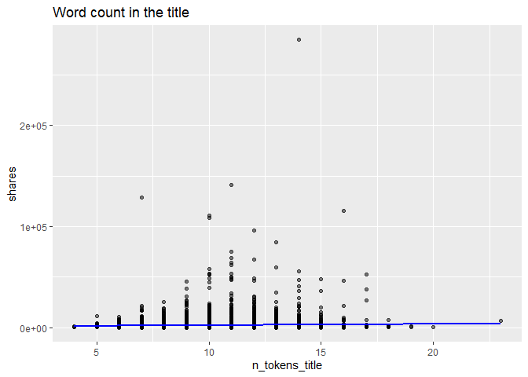
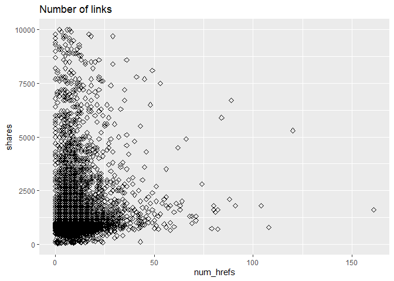
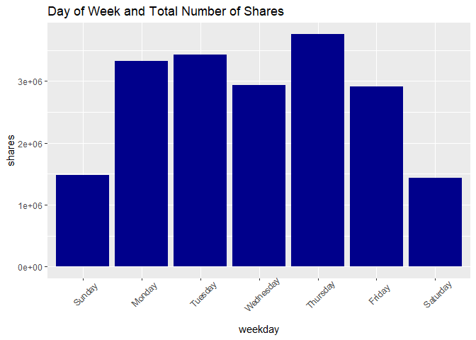
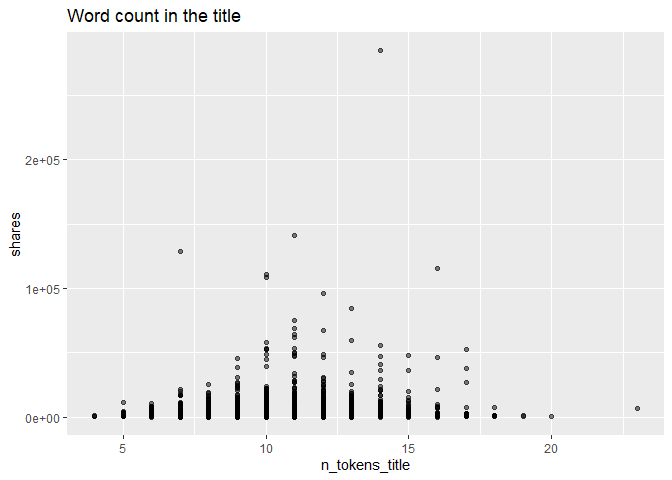
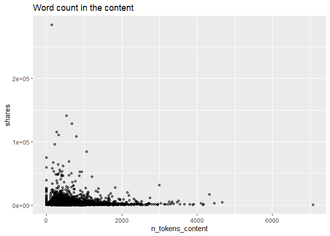

World
================

-   [Intro](#intro)
-   [Requirements](#requirements)
-   [Data manipulaton](#data-manipulaton)
    -   [Read in Data](#read-in-data)
-   [Summarizations](#summarizations)
    -   [Exploratory Data Anaysis](#exploratory-data-anaysis)
    -   [Shares by days of week](#shares-by-days-of-week)
    -   [shares by popularity](#shares-by-popularity)
    -   [count of news by popularity over different days of
        week](#count-of-news-by-popularity-over-different-days-of-week)
    -   [Number of links](#number-of-links)
    -   [Days of week](#days-of-week)
    -   [Number of words in the title and
        content](#number-of-words-in-the-title-and-content)
    -   [Correlation with numeric
        variables](#correlation-with-numeric-variables)

## Intro

placeholder

## Requirements

``` r
library(tidyverse)
```

## Data manipulaton

### Read in Data

``` r
# read entire dataset
  # subset to get the data channel we want
    # remove unnessary columns
df <- read_csv('data/OnlineNewsPopularity.csv') %>%
        filter((!!sym(paste0('data_channel_is_', params$channel))) == 1) %>%
          select(-contains('data_channel_is'))
```

    ## Rows: 39644 Columns: 61

    ## -- Column specification ---------------------------------------------------------
    ## Delimiter: ","
    ## chr  (1): url
    ## dbl (60): timedelta, n_tokens_title, n_tokens_content, n_unique_tokens, n_non...

    ## 
    ## i Use `spec()` to retrieve the full column specification for this data.
    ## i Specify the column types or set `show_col_types = FALSE` to quiet this message.

``` r
dim(df)
```

    ## [1] 8427   55

``` r
# Create a variable that holds day of week
levels = c('Sunday', 'Monday', 'Tuesday', 'Wednesday','Thursday', 'Friday', 'Saturday')
df <- df %>% mutate(weekday = ifelse(weekday_is_monday==1, 'Monday', 
                                ifelse(weekday_is_tuesday==1, 'Tuesday',
                                ifelse(weekday_is_wednesday==1, 'Wednesday',
                                ifelse(weekday_is_thursday==1, 'Thursday', 
                                ifelse(weekday_is_friday==1, 'Friday',
                                ifelse(weekday_is_saturday==1, 'Saturday', 'Sunday'
                                       ))))))) %>%
                mutate(weekday = factor(weekday, levels = levels))


# function to create the popularity column. 
# popularity rating was created with summary stat info (25%, median, and 75%)
popularityCol <- function(dataset){
  dataset <- dataset %>% 
    mutate("Popularity" = if_else(shares > 2800, "Very popular",
                           if_else(shares > 1400, "Somewhat popular", 
                            if_else(shares > 946, "Not too popular", "Not at all popular")) 
                           )
    )            
  return(dataset)
}

# Data set using popularityCol function.
df <- popularityCol(df) %>% as_tibble()

# Overwrite popularity column with factor version
df$Popularity <- as.factor(df$Popularity)

# Use ordered function on a factor to order the levels
df$Popularity <- ordered(df$Popularity, levels = c("Not at all popular", "Not too popular", "Somewhat popular", "Very popular"))


#Channel <- params$channel

#df <- filter(df, channel)

#split data intro train and test sets
#train_rows <- sample(nrow(df), 0.7*nrow(df))
#trainData <- df[train_rows,] %>%
#testData <- df[-train_rows,] 
```

## Summarizations

### Exploratory Data Anaysis

The summary statistics of targeted variable (shares)

``` r
# summary statistics
share_stat <- df %>% 
                summarise(Count = n(),
                          Min = min(shares), 
                          Q1 = quantile(shares, 0.25),
                          Median = median(shares),
                          Average = mean(shares),
                          Q3 = quantile(shares, 0.75),
                          Max = max(shares),
                          Std.Dev = sd(shares)
                          )

# Display a table of the summary stats.
knitr::kable(share_stat, caption = "Summary Stats by shares", digits = 2)
```

| Count | Min |  Q1 | Median | Average |   Q3 |    Max | Std.Dev |
|------:|----:|----:|-------:|--------:|-----:|-------:|--------:|
|  8427 |  35 | 827 |   1100 | 2287.73 | 1900 | 284700 | 6089.67 |

Summary Stats by shares

### Shares by days of week

``` r
df %>%
  group_by(weekday) %>%
  summarise(total_shares = sum(shares), avg_shares = round(mean(shares)), max_shares = max(shares)) %>%
  knitr::kable()
```

| weekday   | total\_shares | avg\_shares | max\_shares |
|:----------|--------------:|------------:|------------:|
| Sunday    |       1477309 |        2605 |       55600 |
| Monday    |       3330409 |        2456 |      141400 |
| Tuesday   |       3432328 |        2220 |      115700 |
| Wednesday |       2941868 |        1880 |       53500 |
| Thursday  |       3756199 |        2394 |      284700 |
| Friday    |       2908077 |        2228 |      128500 |
| Saturday  |       1432545 |        2760 |       75500 |

### shares by popularity

``` r
df %>% 
  group_by(Popularity) %>%
  summarise(total_shares = sum(shares), avg_shares = round(mean(shares)), max_shares = max(shares)) %>%
  knitr::kable()
```

| Popularity         | total\_shares | avg\_shares | max\_shares |
|:-------------------|--------------:|------------:|------------:|
| Not at all popular |       2162892 |         712 |         946 |
| Not too popular    |       2841343 |        1157 |        1400 |
| Somewhat popular   |       3341600 |        1958 |        2800 |
| Very popular       |      10932900 |        8896 |      284700 |

### count of news by popularity over different days of week

``` r
#Bar plot of weekday by popularity 

ggplot(data = df, aes(x = weekday)) +
  geom_bar(aes(fill = as.factor(Popularity))) + 
  labs(x = "Days of week", 
       title = "Days of week by popularity") +
  theme(axis.text.x = element_text(angle = 45, hjust=1)) +
  scale_fill_discrete(name = "Popularity") 
```

<!-- -->

### Number of links

``` r
# simple scatter plot
g1 <- df %>% ggplot(aes(x=num_hrefs, y=shares)) +
        geom_point(size=2, shape=23) +
        ylim(0, 10000)
g1
```

    ## Warning: Removed 254 rows containing missing values (geom_point).

<!-- -->

### Days of week

``` r
# histogram for day of week vs shares

g2 <- df %>% ggplot(aes(x=weekday, y=shares)) +
        geom_bar(stat="identity", fill = "darkblue") + 
   theme(axis.text.x = element_text(angle = 45, vjust = .75)) +
        ggtitle('Day of Week and Total Number of Shares')
g2
```

<!-- -->

### Number of words in the title and content

``` r
#scatter plots of Number of words in the title
g3 <- ggplot(data = df, aes(x =  n_tokens_title, 
                      y = shares)) +
      geom_point(alpha = 0.50) + 
  #theme(axis.text.x = element_text(angle = 45, hjust = 1)) + 
      ggtitle("Word count in the title")  
g3
```

<!-- -->

``` r
#scatter plots of Number of words in the content
g4 <- ggplot(data = df, aes(x =  n_tokens_content, 
                      y = shares)) +
      geom_point(alpha = 0.50) + 
  #theme(axis.text.x = element_text(angle = 45, hjust = 1)) + 
      ggtitle("Word count in the content")   
g4
```

<!-- -->

### Correlation with numeric variables

``` r
knitr::kable(round(cor(df[ , c(3:4, 10:11)]), 2))
```

|                    | n\_tokens\_title | n\_tokens\_content | num\_imgs | num\_videos |
|:-------------------|-----------------:|-------------------:|----------:|------------:|
| n\_tokens\_title   |             1.00 |               0.05 |     -0.01 |        0.03 |
| n\_tokens\_content |             0.05 |               1.00 |      0.24 |        0.06 |
| num\_imgs          |            -0.01 |               0.24 |      1.00 |       -0.03 |
| num\_videos        |             0.03 |               0.06 |     -0.03 |        1.00 |

``` r
library(corrplot)
corrplot(cor(df[c(3:4, 10:11, 13, 43:44)]))
```

<!-- -->
